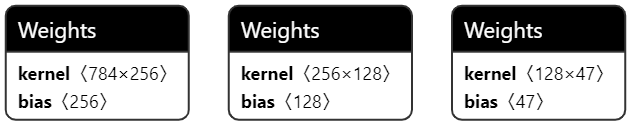

201158825 Thariq Fahry Mini-Project

## Overview
Hi! Desu Note is a friendly note-taking app for the DE-1 SoC with an artificial neural network that lets you write notes in your own handwriting!  

## Folder structure
| Path                       | Purpose |
| ---                        | --- |
| `Mini-Project/CustomProjectDrivers/`| Hardware drivers |
| `Mini-Project/DesuNote/`| App code
| `Mini-Project/Graphics/`| Bitmaps used in app |
| `Mini-Project/NeuralNetwork/`| Neural network library |
| `Mini-Project/HelperFunctions/`| Various helper functions |
| `Python/`                  | Neural network training code |
| `README.md`                | This file |

## Neural network
### Architecture
This is my architecture. I have 3 layers. I am written in C!

 

I am trained on the [Extended MNIST](https://www.nist.gov/itl/products-and-services/emnist-dataset) dataset, and I take a 28x28 inference vector as my input. That's a 28x28 array containing a picture of a single character in your own handwriting! 

I produce a probability vector of the 47 classes in the EMNIST ByMerge dataset. That means I can recognise 47 different hand-written characters. Isn't that cool!

## GUI
### Handwriting interface
Write notes in your own handwriting!  

### File interface
See notes you've written!  
  

### Name interface
Tell me your name!  

