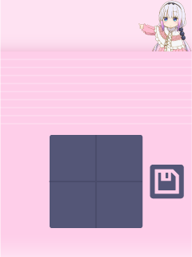
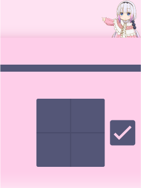

201158825 Thariq Fahry Mini-Project

## Overview
Hi! Desu Note is a friendly note-taking app for the DE-1 SoC with an artificial neural network that lets you write notes in your own handwriting!  

## Folder structure
| Path                       | Purpose |
| ---                        | --- |
| `Mini-Project/CustomProjectDrivers/`| Hardware drivers |
| `Mini-Project/DesuNote/`| App code
| `Mini-Project/Graphics/`| Bitmaps used in app |
| `Mini-Project/NeuralNetwork/`| Neural network library |
| `Mini-Project/HelperFunctions/`| Various helper functions |
| `Python/`                  | Neural network training code |
| `README.md`                | This file |

### Handwriting interface
Write notes in your own handwriting!  

### File interface
See notes you've written!  
  

### Name interface
Tell me your name!  

